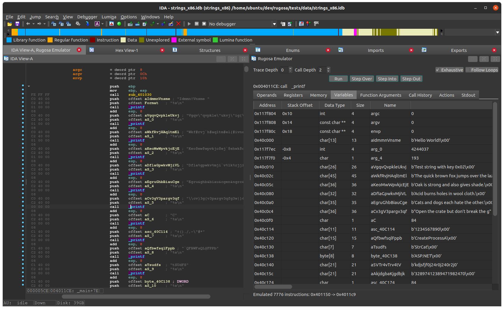
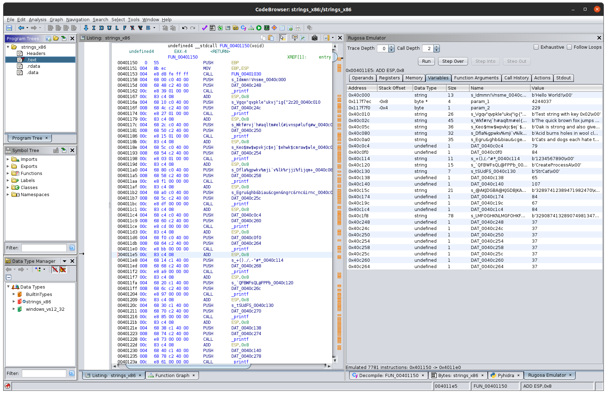

# Rugosa

The next generation of [kordesii](https://github.com/Defense-Cyber-Crime-Center/kordesii). 
This is a library (not a framework) for managing emulation and provides utilities 
for interfacing with decompiled malware samples using [dragodis](https://github.com/Defense-Cyber-Crime-Center/dragodis).

Rugosa is meant to be used with an automation framework such as [DC3-MWCP](https://github.com/Defense-Cyber-Crime-Center/DC3-MWCP),
but can also be used in one-off scripting.


## Install

```
pip install rugosa
```

You will also need to setup a backend disassembler by following [Dragodis's installation instructions](https://github.com/Defense-Cyber-Crime-Center/dragodis/blob/master/docs/install.rst).


## Utilities

The following utilities are included with Rugosa:
- [Emulation](./docs/CPUEmulation.md)
- [Extra Disssembly Interfaces](./rugosa/disassembly.py)
- [Regex](./docs/Regex.md)
- [Strings](./rugosa/strings.py)
- [YARA](./docs/YARA.md)


## Emulator Plugin

Rugosa includes a IDA and Ghidra plugin which provides a GUI for using the [emulation](./docs/CPUEmulation.md) utility.
For more information on how to install and use the plugin please see the [documentation](./docs/EmulatorPlugin.md).




