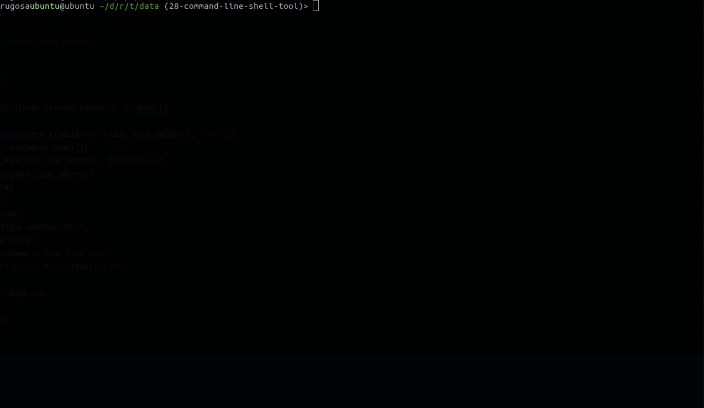

# Rugosa

Rugosa is a static malware analysis library and tool developed using the disassembler-agnostic 
[dragodis](https://github.com/dod-cyber-crime-center/dragodis) API. It incorporates a binary emulation framework along with
utilities for regex and YARA searching, string extraction, and function discovery within disassembled code.
These features enhance capabilities for comprehensive malware analysis and metadata extraction.

Rugosa utilizes an in-house developed emulation engine entirely written in Python to achieve full control of the execution
context and offer high-level abstractions for emulated artifacts. 
It adopts a targeted approach employing branch path tracing to emulate portions of code without the need to fully
emulate preceding code or modify the binary to accommodate such control flow.

Currently, x86 and ARM processors are supported.


## Install

```
pip install rugosa
```

You will also need to setup a backend disassembler by following [Dragodis's installation instructions](https://github.com/Defense-Cyber-Crime-Center/dragodis/blob/master/docs/install.rst).


## Utilities

The following utilities are included with Rugosa:
- [Emulation](./docs/CPUEmulation.md)
- [Extra Disssembly Interfaces](./rugosa/disassembly.py)
- [Regex](./docs/Regex.md)
- [Strings](./rugosa/strings.py)
- [YARA](./docs/YARA.md)


## Interactive Shell

Rugosa includes an interactive shell created with [cmd2](https://cmd2.readthedocs.io) for emulating and traversing a given binary.
For more information on how to use the tool, please see the [documentation](./docs/Shell.md).




## Emulator Plugin

Rugosa includes a IDA and Ghidra plugin which provides a GUI for using the [emulation](./docs/CPUEmulation.md) utility.
For more information on how to install and use the plugin please see the [documentation](./docs/EmulatorPlugin.md).


