# Emulator Plugin

Rugosa includes an IDA and Ghidra plugin for using the [emulation](./CPUEmulation.md) utility.

### IDA Install

To install the plugin run the following after IDA has been setup and rugosa has been installed.
You can then activate the plugin by either accessing it from the plugin menu or pressing the keyboard shortcut Ctrl-Alt-R

```console
$ python -m rugosa.ida_plugin.install
```

To uninstall run the following:

```console
$ python -m rugosa.ida_plugin.uninstall
```


### Ghidra Install

The Ghidra plugin will automatically be installed when launching Ghidra from the [pyhidra](https://github.com/dod-cyber-crime-center/pyhidra)
launcher by calling `pyhidraw`. *(Ghidra must be started with pyhidra in order for the plugin to function properly.)*

To enable the plugin go to `File -> Configure...`, then select to configure Experimental plugins.

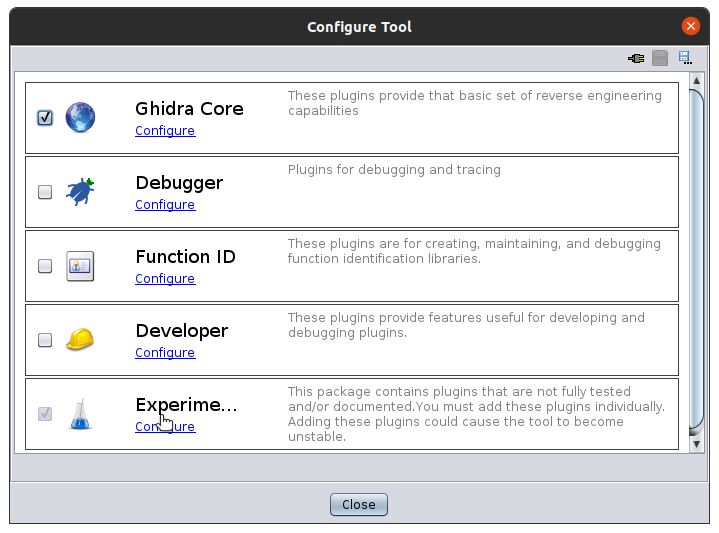

Then select `RugosaPlugin`.

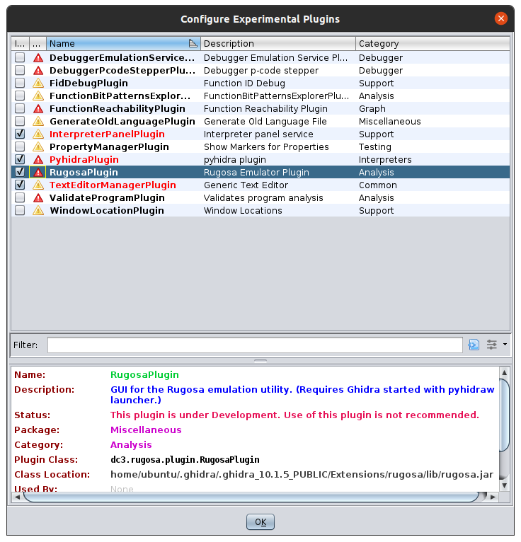

You should then be able to select `Rugosa Emulator` in the `Windows` menu.


## Component Overview


### Controls
 
To start using the Rugosa emulator, highlight an instruction in the disassembly view and then click the 
"Run" button. This will cause the emulator to trace a path up from the given instruction to the start 
of the function and then emulate the path. You can then view the contents of the CPU context using the 
tabs below the controls.

You can set a "Trace Depth" to set the number of levels of parent function callers to also be emulated
first before starting to emulate the start of the current function. 
You can also set the "Call Depth" to the number of function call levels deep to emulate within the current function.

The "Follow Loops" checkbox is used to determine whether emulation should follow looping or whether to only
emulate a direct path downward.
The "Exhaustive" checkbox is used to set if loop following should be enabled for all callers as well.

After the initial run, you can use the "Step Over" button to emulate the current instruction the 
CPU context is currently at. 

Please note, the "Step Into" and "Step Out" buttons are currently nonfunctional. This feature is currently in development.

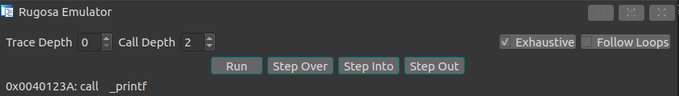


### Navigation

Double-clicking on any valid address will cause the disassembler to jump to the line in the listing view.

Also, in most tables you can also right click on the row to get options to either jump to the 
dissasembly or view the contents in the memory tab.
Options will be grayed out if address is not valid.

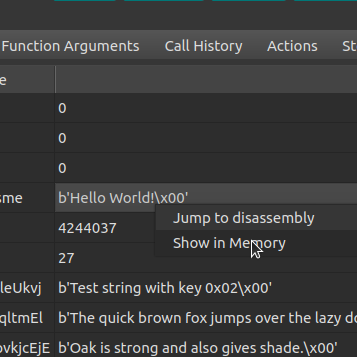


### Operands

The operands tab provides information about the operands the cpu context is currently pointing to.
This allows you to see the currently set values for the operands right before it would have been emulated.

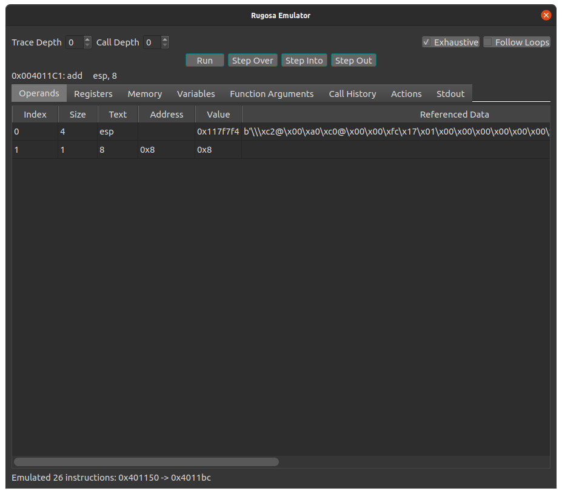

### Registers

The registers tab provides a table for the currently set registers within the current cpu context.

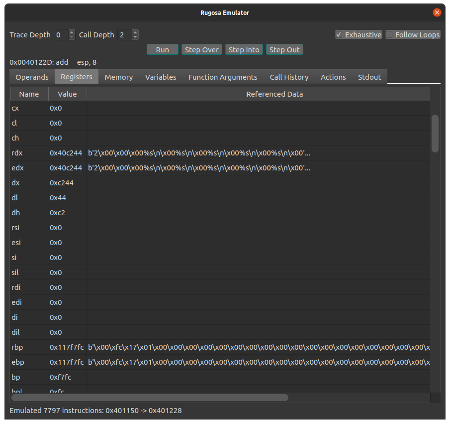

### Memory

The memory tab provides a way to view the virtual memory within the current cpu context. 
This tab can be used to view the contents of any pointers found within the other tabs.

To view a window of memory, set a starting address and size and then click the "Load" button. 
You can then export the currently shown memory to a file for further analysis by clicking the "Export" button.

The table below the hex view is a list of the currently mapped memory regions in the cpu context.
Double-clicking on an entry will load the memory region in the hex view.
(The memory starting with `0x117f000` is the designated stack space for the cpu context.)

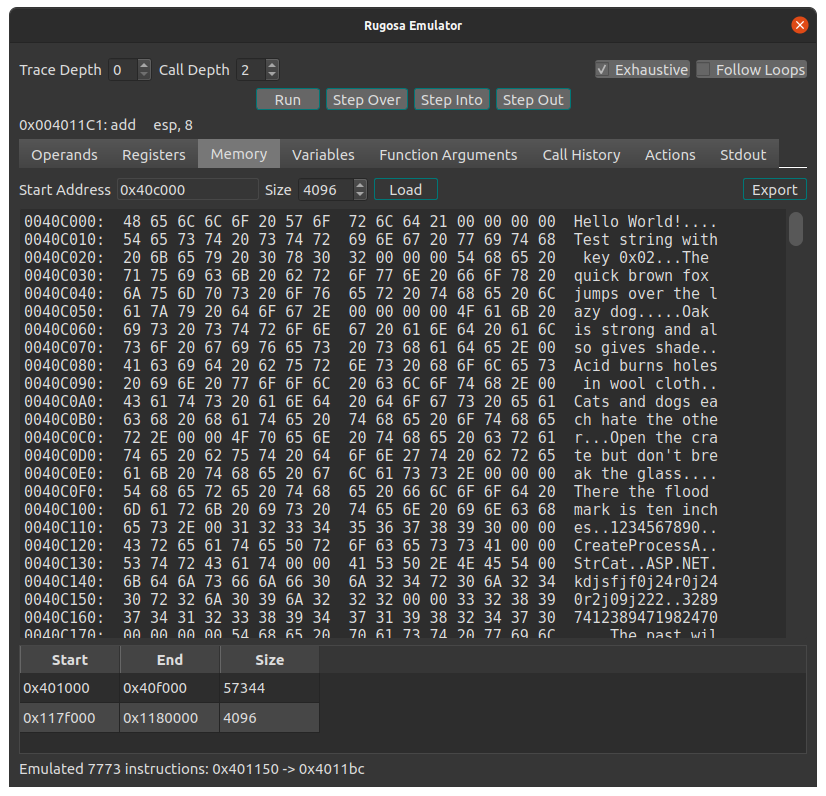

### Variables

The variables tab provides a table of labeled data that has been encountered during emulation.
This allows you to view the current contents of each variable within the current cpu context.
Double-clicking on the address will jump the disassembly cursor to the data item if available.

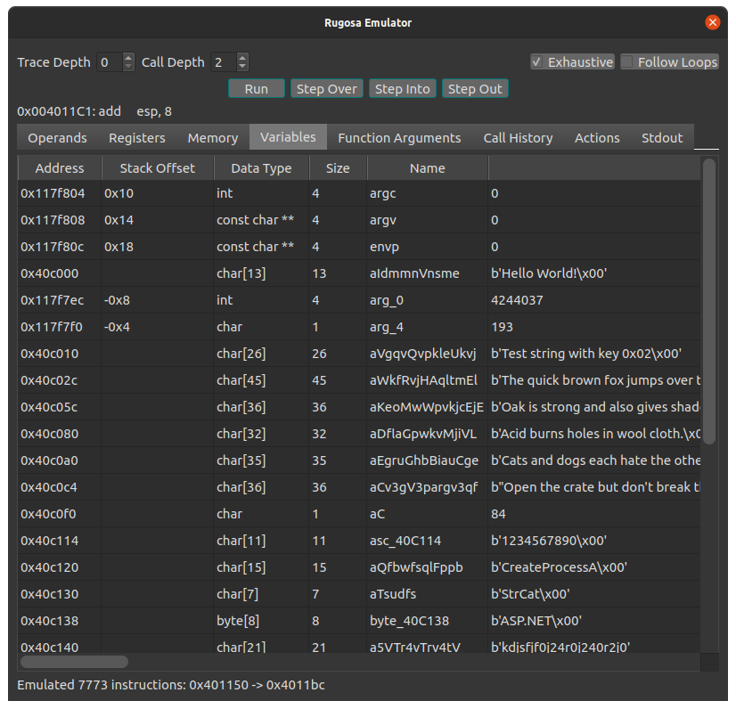


### Function Arguments

The function arguments tab provides the contents of the current arguments if the cpu context is on
a call instruction. Incrementing the "Number of Arguments" will show you the contents for additional
arguments. (Useful for variadic arguments)

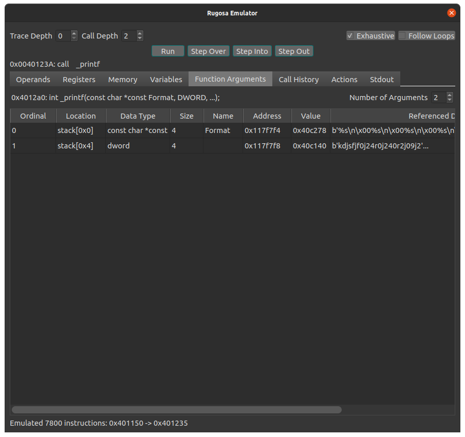

### Call History

The call history tab will show you all the function calls encountered during emulation and the contents
of the arguments.

Double-clicking on an address will jump the disassembly cursor to the instruction where the call occurred.

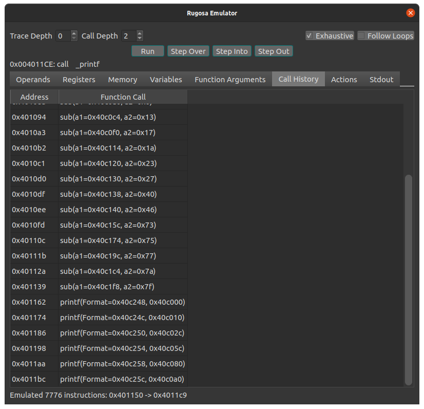

### Actions

The actions tab provides a listing of all the interesting actions that occurred during emulation.
These usually consist of file operations, service creation, registry modification, etc.

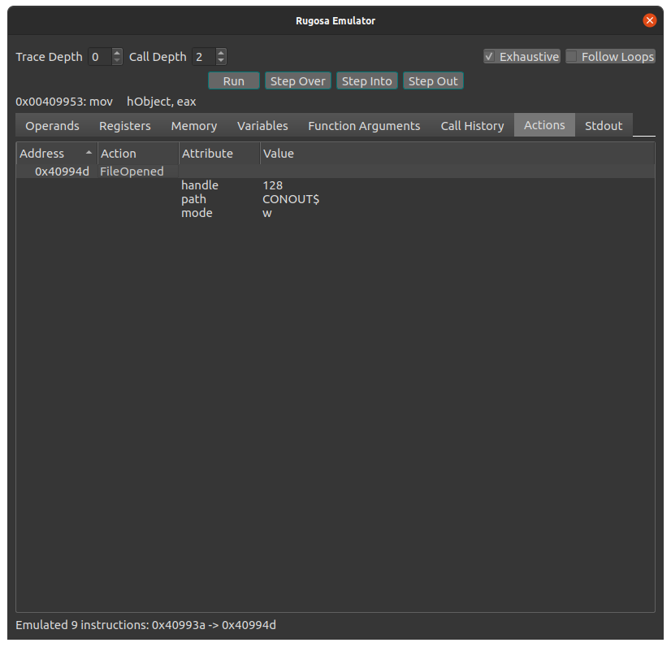

### Stdout

The stdout tab provides the contents of the stdout stream within the current cpu context.
This will allow you to view and export anything the sample tried to print to the console.

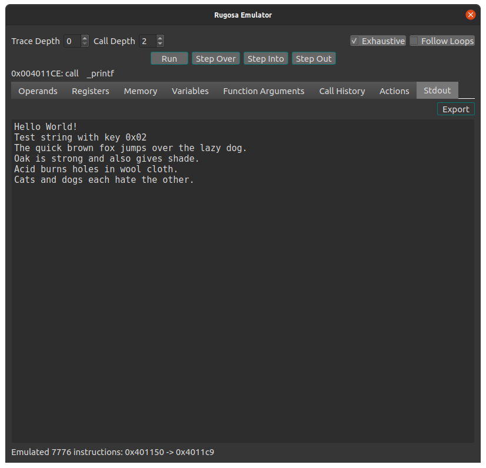
